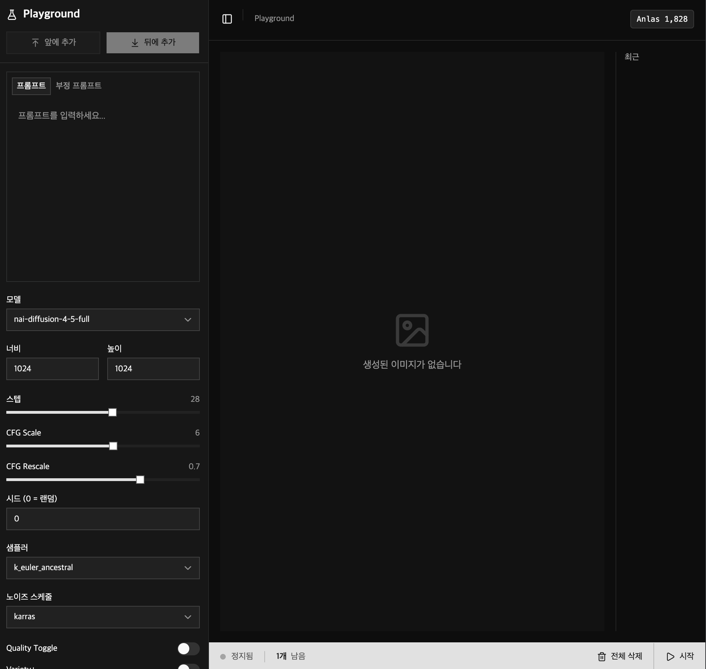
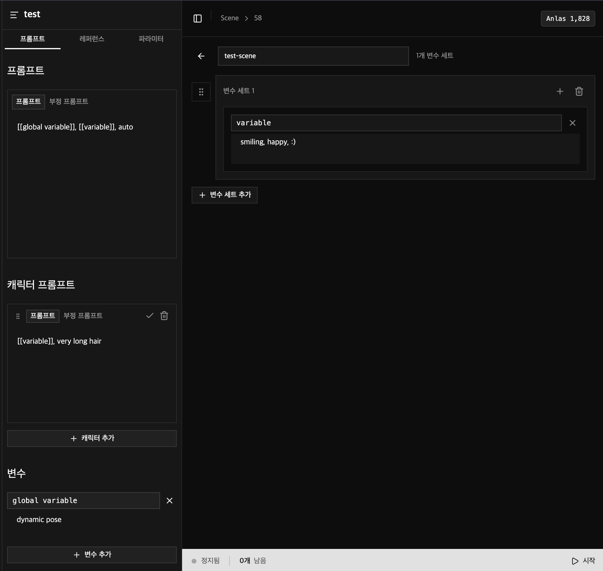
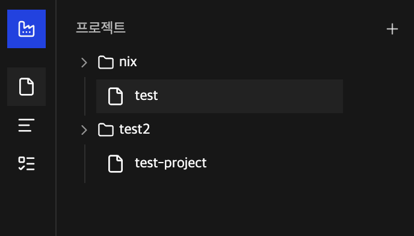
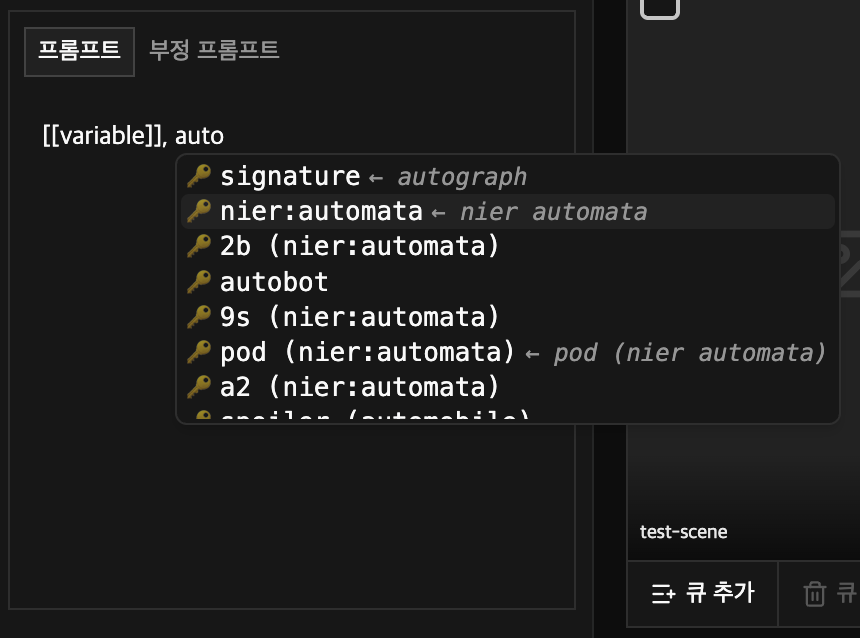
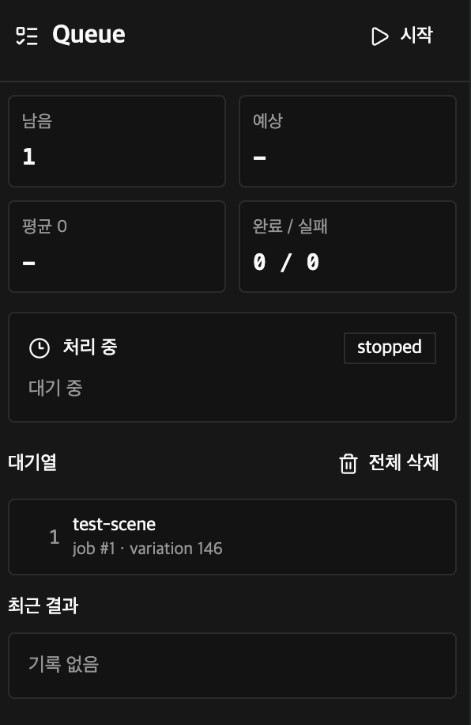
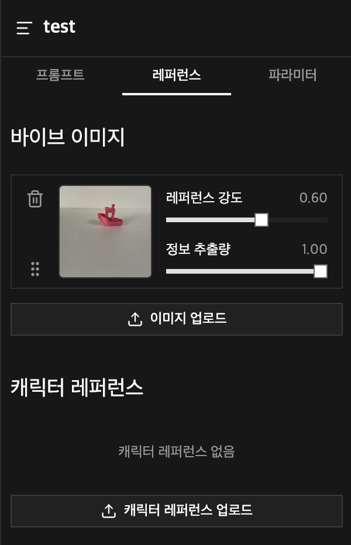

# NAI Factory

A local web app for organizing NovelAI image-generation work around projects, scenes, and queues.

NAI Factory is built for managing image-generation workflows that involve many scenes and prompt variations. You can split work into projects, reuse global and scene-level variables, queue generation jobs, and keep generated images stored locally.

> This is not an official NovelAI application.

## Screenshots

Playground for quick one-off generations and reviewing recent outputs.



Scene variables can be reused inside prompts to keep repeated settings tidy.



Project groups help keep related scenes organized.



Prompt autocomplete helps with NovelAI tags while editing prompts.



The queue manager shows pending and running generation jobs.



Cached vibe transfer images can be reused without re-uploading them every time.



## Features

- Project, group, scene, and variation management
- Prompt and negative prompt editing
- Global and scene-level variables
- Tag autocomplete
- NovelAI image generation queue
- Playground mode for quick generations
- Character reference and vibe transfer support
- Cached vibe transfer images
- Local image and thumbnail storage
- SD Studio import
- Local SQLite database

## Getting Started

Requirements:

- [Bun](https://bun.sh/)
- A NovelAI account with image generation access

Install dependencies:

```sh
bun install
```

Start the development server:

```sh
bun dev
```

Open the web app:

```text
http://localhost:5173
```

The API server runs at `http://localhost:3000`.

## Docker

You can also run the app with Docker:

```sh
docker compose up --build
```

Open the app:

```text
http://localhost:3000
```

Stop the container:

```sh
docker compose down
```

Remove saved Docker data as well:

```sh
docker compose down -v
```

## Settings

After starting the app, open Settings and enter your NovelAI API key. Settings are saved automatically.

In development mode, local data is stored under `server/data`. With Docker, data is stored in the `nai_factory_data` volume.

Keep your API key, local database, generated images, and `.env` files out of public repositories.

## Scripts

```sh
bun dev       # Start the API server and web dev server
bun build     # Build for production
bun test      # Run tests
bun check     # Run Biome checks
```
