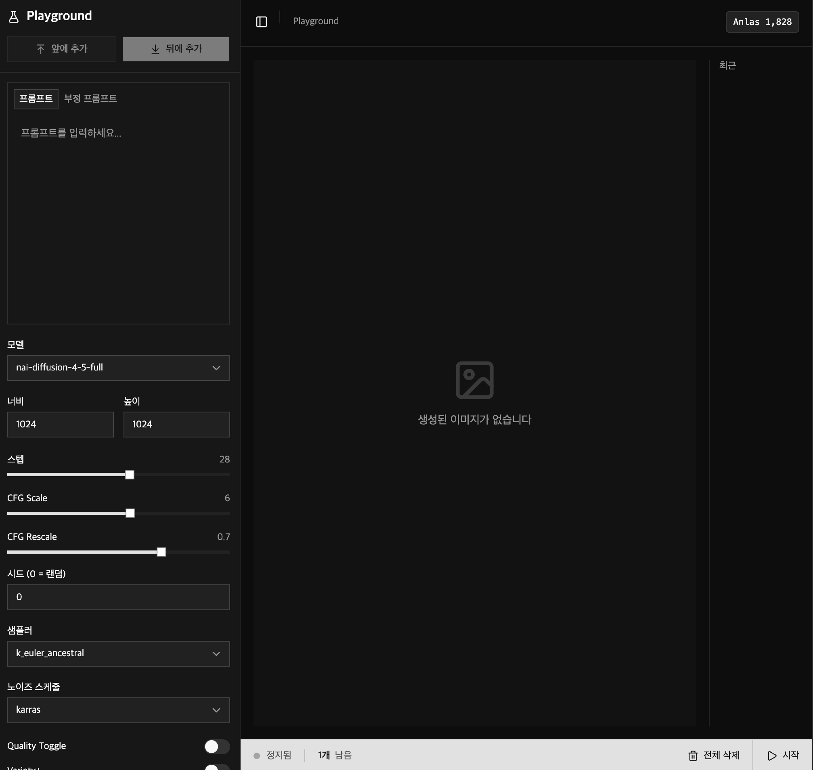
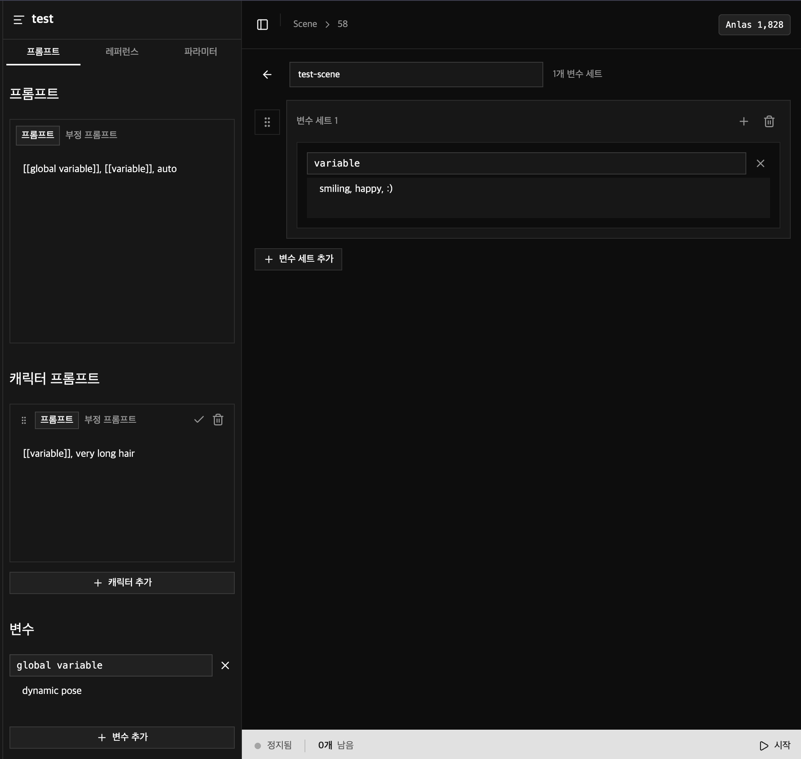
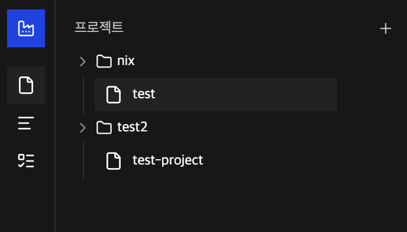
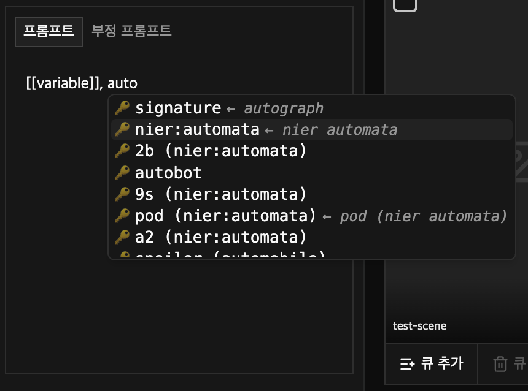
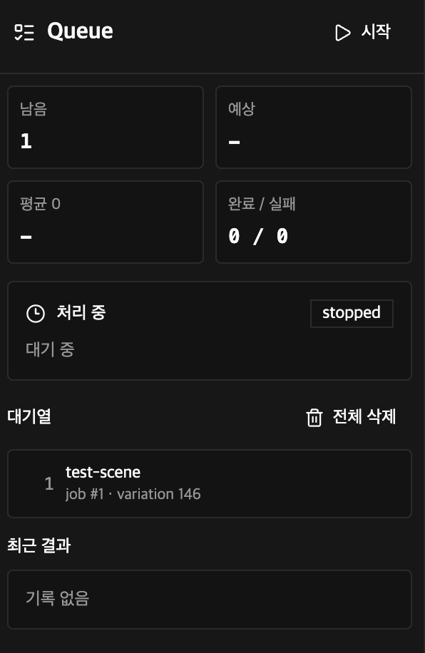
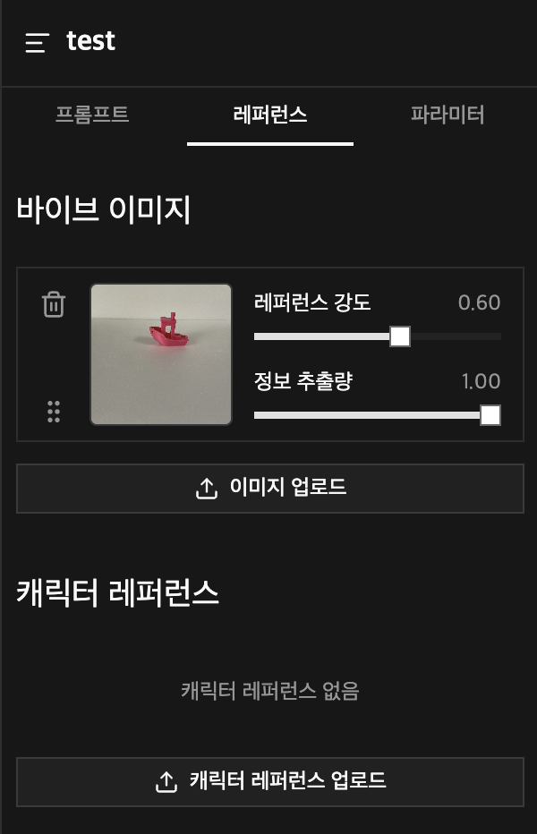

# NAI Factory

A local web app for organizing NovelAI image-generation work around projects, scenes, and queues.

NAI Factory is built for managing image-generation workflows that involve many scenes and prompt variations. You can split work into projects, reuse global and scene-level variables, queue generation jobs, and keep generated images stored locally.

> This is not an official NovelAI application.

## Screenshots

Playground for quick one-off generations and reviewing recent outputs.



Scene variables can be reused inside prompts to keep repeated settings tidy.



Project groups help keep related scenes organized.



Prompt autocomplete helps with NovelAI tags while editing prompts.



The queue manager shows pending and running generation jobs.



Cached vibe transfer images can be reused without re-uploading them every time.



## Features

- Project, group, scene, and variation management
- Prompt and negative prompt editing
- Character prompts with positions on NovelAI's 5×5 grid, in projects and Playground
- Global and scene-level variables
- Tag autocomplete
- NovelAI image generation queue with an image count per queue action and a confirmation
  before large batches
- Size presets and an "Anlas 소모" warning when a size or step count is not free for Opus
- NovelAI Diffusion V5 Full and Curated, alongside V4.5 and V4
- Playground mode for quick generations
- Character reference and vibe transfer support
- Cached vibe transfer images
- Local image and thumbnail storage; images record the variation that produced them
- SD Studio import
- Local SQLite database

V5 uses the Karras noise schedule and currently does not support Variety+, Vibe Transfer,
or Character Reference. Existing project reference images and settings are retained when
switching models, but are not applied to V5 generations.

## Getting Started

Requirements:

- [Bun](https://bun.sh/)
- A NovelAI account with image generation access

Install dependencies:

```sh
bun install
```

Start the development server:

```sh
bun dev
```

Open the web app:

```text
http://localhost:5173
```

The API server runs at `http://localhost:3000`.

## Docker

You can also run the app with Docker:

```sh
docker compose up --build
```

Published images are available from GitHub Container Registry. Each release is tagged `latest`,
`v1`, `v1.0` and `v1.0.0`; pin one of the version tags to control upgrades.

```sh
docker pull ghcr.io/mokyabun/nai-factory:latest
```

Open the app:

```text
http://localhost:3000
```

Stop the container (`docker compose down -v` also removes the saved data):

```sh
docker compose down
```

## Security

NAI Factory has no user accounts. It protects your NovelAI key with these defaults:

- **Local only by default.** The server listens on `127.0.0.1`; the compose file publishes the
  port on `127.0.0.1:3000` only.
- **The API key is write-only.** The server verifies the key with NovelAI and stores it; the API
  only ever returns a masked hint such as `****abcd`.
- **Browser protection.** Requests from other websites are refused (Origin and
  `Sec-Fetch-Site` checks), and unknown host names are refused to block DNS rebinding. IP
  addresses, `localhost` and names in `NAI_FACTORY_ALLOWED_HOSTS` are accepted.
- **Files are served by id** (`/api/assets/:id`), never by path.

**Opening it to your LAN.** Publish the port on all interfaces (`3000:3000` in compose, or
`HOST=0.0.0.0` without Docker). Anyone who can reach the server can then generate images with
your key (they cannot read it). Set `NAI_FACTORY_ACCESS_TOKEN` to require a token; the browser
asks for it once and keeps it in an HttpOnly cookie.

**Server export.** Copying images to a folder on the server machine is off unless
`NAI_FACTORY_EXPORT_DIR` is set. Exports go to a sub-folder of that directory whose name you
enter in the export dialog.

## Configuration

| Variable                                  | Default                    | Description                                                         |
| ----------------------------------------- | -------------------------- | ------------------------------------------------------------------- |
| `HOST`                                    | `127.0.0.1`                | Listen address (`0.0.0.0` in the Docker image)                      |
| `PORT`                                    | `3000`                     | Listen port                                                         |
| `NAI_FACTORY_DATA_DIR`                    | `./data`                   | Data folder (database and files)                                    |
| `DATABASE_URL`                            | `<data dir>/database.db`   | SQLite file                                                         |
| `DATABASE_CACHE_SIZE`                     | `10000`                    | SQLite `cache_size` pragma                                          |
| `NAI_FACTORY_ACCESS_TOKEN`                | —                          | Require this token for every API call                               |
| `NAI_FACTORY_ALLOWED_HOSTS`               | —                          | Comma-separated extra host names                                    |
| `NAI_FACTORY_EXPORT_DIR`                  | —                          | Enables server export below this folder                             |
| `NAI_FACTORY_MAX_UPLOAD_MB`               | `512`                      | Largest request body                                                |
| `NAI_FACTORY_ARCHIVE_MAX_UNCOMPRESSED_MB` | `4096`                     | Largest uncompressed `.naif` archive                                |
| `NAI_FACTORY_DATA_ENCRYPTION_ENABLED`     | `false`                    | Encrypt new files with AES-256-GCM                                  |
| `NAI_FACTORY_DATA_ENCRYPTION_KEY`         | —                          | 32-byte key as base64 or 64 hex characters                          |
| `NAI_FACTORY_NOVELAI_MODE`                | `live`                     | Initial NovelAI mode for a new data folder (`live`, `mock`, `fail`) |
| `NAI_FACTORY_SSE_HEARTBEAT_MS`            | `15000`                    | Realtime event heartbeat                                            |
| `LOG_LEVEL`, `LOG_PRETTY`, `LOG_COLORIZE` | `info`, dev only, dev only | Logging                                                             |

Encryption applies to newly written files and the stored API key; plaintext files stay readable:

```sh
NAI_FACTORY_DATA_ENCRYPTION_ENABLED=true
NAI_FACTORY_DATA_ENCRYPTION_KEY="$(openssl rand -base64 32)"
```

## Data folder

```text
data/
  database.db      SQLite database (WAL mode: also database.db-wal / -shm)
  images/          generated images, by project and scene
  thumbs/          thumbnails
  playground/      playground images and thumbnails
  refs/            vibe transfer and character reference images
  backups/         database copies taken before each upgrade that runs migrations
  trash/           files the database does not know about, kept for 30 days
```

The database stores paths relative to the data folder, so the folder can be moved or mounted
anywhere. To back up, stop the server and copy the whole folder. Before applying new
migrations, the server copies the database to `backups/` (images are not copied); delete old
copies when you no longer need them. At startup and once a day,
files the database does not know about are moved to `trash/<UTC time>/` with their original
paths; moving that folder's contents back into the data folder restores them. Trash folders
are deleted after 30 days.

Data folders from versions before 0.3.0 are not supported: the server refuses to start and asks
for a new folder.

## Settings

After starting the app, open Settings and enter your NovelAI API key. Settings are saved automatically.

Keep your local database, generated images, and `.env` files out of public repositories.

## Development

```sh
bun dev                    # Start the API server and web dev server
bun run build              # Build for production
bun run test               # Run tests
bun run check              # Check formatting, lint, and types
bun run format             # Format with Oxfmt
bun run lint               # Lint with Oxlint
bun db:generate            # Generate a migration after changing server/src/db/schema
```

- API endpoints are declared once in `shared/src/contract`; the server registers them with
  `route()` and the web app calls them with `call()`.
- After changing the database schema, run `bun db:generate` and commit the new migration.
  Never edit a migration that has been released.

Oxfmt and Oxlint share root configuration across all workspaces. Oxlint includes type-aware
checks; dialog and inline rename fields allow autofocus to preserve their keyboard workflow.
